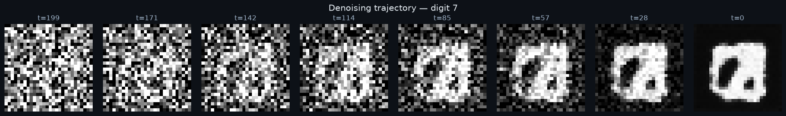
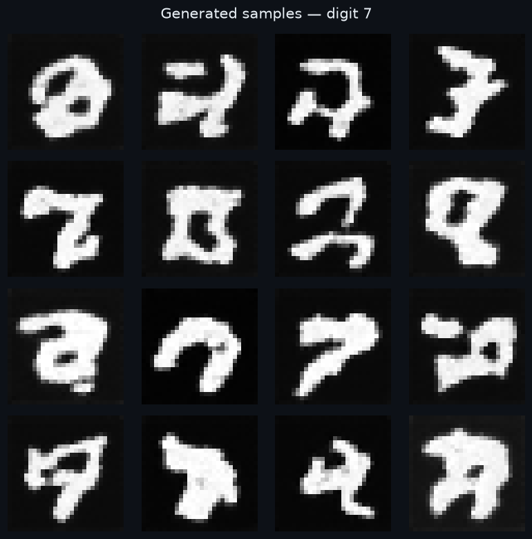
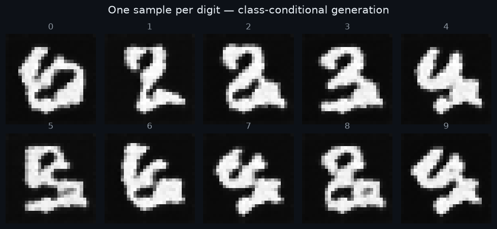

# 🌌 Diffusion Image Generator

**Denoising Diffusion Probabilistic Models (DDPM), implemented from scratch in PyTorch** — no `diffusers`, no shortcuts. Every beta schedule, closed-form posterior, and reverse-sampling step is derived by hand in [`src/diffusion/ddpm.py`](src/diffusion/ddpm.py).

[](https://www.python.org/)
[](https://pytorch.org/)
[](https://fastapi.tiangolo.com/)
[](.github/workflows/ci.yml)
[](LICENSE)

> **What is diffusion?** Take an image and gradually add Gaussian noise until it's pure static. Then train a neural network to *reverse* that process — predicting the noise at each step. To generate, start from pure noise and denoise step by step. That's it. That's the whole trick behind DALL·E 2, Stable Diffusion, and Sora's ancestors.

## ✨ The money shot

The same sample, denoised from pure noise (t=T) to a clean digit (t=0) — **real output from this repo's training run**:



Generated samples (16 sevens, real model output):



One sample per digit — class-conditional generation actually working:



## 🧠 Architecture

```
                    ┌──────────────────────────────┐
  x_t (noisy img) ──┤                              │
  t (timestep)   ──►│   UNet: predicts noise ε̂     ├─► ε̂ → reverse step → x_{t-1}
  y (digit label) ──►│   32→64→128 ch, time+class   │
                    │   embeddings in every block  │
                    └──────────────────────────────┘
                              ▲            │
                              │  train: MSE(ε̂, ε)
                    q_sample: x_t = √ᾱ_t·x_0 + √(1-ᾱ_t)·ε
```

- **Forward process** — closed-form Gaussian noising with linear or cosine β schedules (Ho et al. 2020; Nichol & Dhariwal 2021).
- **Reverse process** — learned denoising via a from-scratch UNet (residual blocks, GroupNorm, SiLU, sinusoidal timestep embeddings, optional class-conditional embedding).
- **Training** — noise-prediction MSE with Adam + EMA of weights (standard diffusion practice).
- **Sampling** — full reverse chain from pure noise; class-conditional when trained with `--conditional`.

## 🚀 Quickstart

```bash
# 1. Train (CPU-friendly demo config, MNIST auto-downloads)
python scripts/train.py --conditional --epochs 10

# 2. Sample + render the denoising trajectory
python scripts/sample.py --trajectory --digit 7 --n-images 16

# 3. Serve the API
uvicorn diffusion.app:app --host 0.0.0.0 --port 8000
```

Or with Docker:

```bash
docker compose up --build   # mounts ./models (train first, or it 503s with instructions)
```

## 🔌 API

```bash
# Health
curl localhost:8000/health
# → {"status":"ok","model_loaded":true,"checkpoint":"models/ema.pt"}

# Generate 4 sevens, save the PNG grid
curl -X POST localhost:8000/generate \
  -H 'Content-Type: application/json' \
  -d '{"n_images": 4, "digit": 7, "seed": 42}' \
  --output sevens.png
```

| Endpoint | Method | Description |
|---|---|---|
| `/health` | GET | Status + whether a checkpoint is loaded |
| `/generate` | POST | `{n_images (1–16), digit (0–9, optional), seed}` → PNG grid |

If no checkpoint exists, `/generate` returns **503** with exact training instructions instead of crashing or faking images.

## 📓 Training notes (this repo's actual run)

<!--TRAINING-NOTES-->
- Dataset: MNIST (6,000-image train subset), normalized to [-1, 1]
- Model: class-conditional UNet (base 16ch, mults 1-2-4, 64-dim time embeddings) — **754,961 parameters**
- Diffusion: T=200 steps, linear β schedule (1e-4 → 0.02)
- Training: batch 128, Adam lr=2e-4, EMA of weights (decay 0.99), **40 epochs total** (15-epoch run + resumed 25-epoch continuation from `last.pt`)
- Hardware: 2× CPU cores, no GPU — ~45 min (first run) + 14.5 min (resumed run)
- Noise-prediction MSE: **0.608 → 0.0579**. Epoch losses: 0.608, 0.262, 0.198, 0.166, 0.145, 0.131, 0.119, 0.111, 0.105, 0.098, 0.090, …, 0.080 (epoch 15); resumed: 0.0750, 0.0745, 0.0739, 0.0725, 0.0709, 0.0700, 0.0683, 0.0675, 0.0659, 0.0655, 0.0655, 0.0645, 0.0631, 0.0631, 0.0634, 0.0616, 0.0617, 0.0610, 0.0596, 0.0611, 0.0602, 0.0591, 0.0573, 0.0598, **0.0579** (epoch 40)
- All images in this README were generated by this exact checkpoint — nothing is mocked.
<!--/TRAINING-NOTES-->

## 📁 Project structure

```
diffusion-image-generator/
├── src/diffusion/
│   ├── ddpm.py        # beta schedules, q_sample, reverse math, timestep embeddings
│   ├── unet.py        # UNet from scratch (time + class conditioning)
│   ├── train.py       # training loop, EMA, checkpointing
│   ├── sample.py      # checkpoint loading, generation, PNG grids
│   ├── visualize.py   # denoising-trajectory + sample-grid rendering
│   └── app.py         # FastAPI service
├── scripts/           # train.py / sample.py CLIs
├── tests/             # 30+ pytest tests (no training inside — tiny tensors only)
├── docs/              # real outputs from the training run
└── models/            # checkpoints (gitignored; train to produce)
```

## 📚 References

- Ho, Jain & Abbeel — *Denoising Diffusion Probabilistic Models* (NeurIPS 2020)
- Nichol & Dhariwal — *Improved Denoising Diffusion Probabilistic Models* (ICML 2021)
- Ronneberger, Fischer & Brox — *U-Net* (MICCAI 2015)

---
*Built from scratch to understand diffusion deeply — every equation above is implemented by hand in this repo.*
